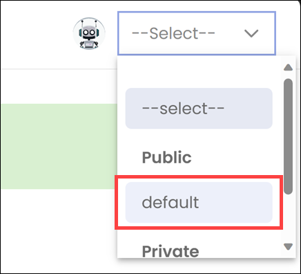

# Participant guide

- [Participant guide](#participant-guide)
  - [1. Access the user portal](#1-access-the-user-portal)
  - [2. Experiment with a Knowledge Management agent](#2-experiment-with-a-knowledge-management-agent)
  - [3. Access the Agent configuration](#3-access-the-agent-configuration)
  - [4. Ask the anomaly agent about anomalies](#4-ask-the-anomaly-agent-about-anomalies)
  - [5. Experiment with a Data Analytics agent](#5-experiment-with-a-data-analytics-agent)
  - [6. Review the dataset](#6-review-the-dataset)
    - [Sample prompts](#sample-prompts)

## 1. Access the user portal

FoundationaLLM provides a chat-based user interface (user portal) to interact with LLM agents and ask questions about your data. Complete the following steps to access the web app:

1. Navigate to <https://fllmad01chatuica.orangeisland-5b7e94c0.southcentralus.azurecontainerapps.io>
2. Select **Sign in**.

    

3. When prompted, enter the `xxx_nnn@solliancetraining.onmicrosoft.com` email address we provided at the beginning of the session.

    

4. Select **Next**, enter your provided password at the prompt, then select **Sign in**.

5. **VERY IMPORTANT!** If you are prompted to download and set up the Microsoft Authenticator app within an Action Required dialog, select **Ask later**. Please **do not** set up multi-factor authentication with this account.

    

6. The user portal appears with an empty chat history (1), input box for asking questions to the agent (2), and an agent select list (3) that lets you select either the default agent or the private anomaly agent that you will configure (more on this in a bit).

    

## 2. Experiment with a Knowledge Management agent

As a first experience, you will interact with a knowledge management agent that can answer questions about FoundationaLLM, drawing on knowledge provided to the pre-trained LLM by FoundationaLLM.

1. From the agent select list, choose **default**.

    

2. In that chat window, ask:

    `"What is your name?"`

3. Read the response of the agent.

4. At the bottom right, below the agent response select **View Prompt**.

    

    > [!NOTE]
    > Take note of the User prompt (which was your question), and the Prompt template. The prompt template is the system prompt that is used to provide the LLM instruction about how to address the user.

5. Now ask:

    `"Can you present as bullets the key points about FoundationaLLM?"`

6. Read the response.

    But how does the LLM, which a large language model pre-trained on Internet data know anything about FoundationaLLM whose website was not even around when the LLM was trained?

    Simply put, we gave it a text description of FoundationaLLM at the same time that we submitted the user prompt and system prompt to the LLM. This is an example of in-context learning, as you have provided the agent some knowledge that the underlying LLM was not trained upon to use as a reference when answering questions.

    In the next task, you will take a look at the source text that was configured for use by the agent, to give this knowledge.

## 3. Access the Agent configuration

FoundationaLLM (FLLM) follows a configuration-based approach to defining FLLM agents. This enables organizations to manage agents and their behaviors without requiring code modifications or new deployments.

Follow the steps below to sign in to Azure and access your files:

1. In a new browser tab, navigate to <https://portal.azure.com>.

2. If prompted, sign in with your `xxx_nnn@solliancetraining.onmicrosoft.com` account. When the portal comes up, you will see a notification that you do not have any Azure subscriptions.

    

3. Select the **Settings** button (1) in the top toolbar to switch directories. Select **Switch** next to the "Solliance, Inc." directory name. Please note, you might have to go through this step a number of times before the portal switches directories.

    

4. Scroll down on the portal home page and select **Resource groups**, then select the `foundationallm-after-dark` resource group.

    

5. Scroll down the list of resources and select the **fllmad01sa** storage account.

    

6. Select **Storage browser** in the left-hand menu (1), expand **Blob containers** (2), then select the **foundationallm-source** container (3).

    

7. Right-click next to the **about.txt** file, then select **View/edit**. That text is what is being provided to the LLM as context when answering questions about FoundationaLLM.

    

While simple in approach, the illustrates a very powerful capability of LLMs that is few shot learning- they are able to learn new knowledge from text examples provided them. The key nuance here is that the underlying deep learning based model is not trained or fine tuned to give it this new knowledge, which enables the model to learn more quickly since training a model takes hours to days.

## 4. Ask the anomaly agent about anomalies

1. Return to <https://fllmad01chatuica.orangeisland-5b7e94c0.southcentralus.azurecontainerapps.io>.

2. From the agent select list, choose your private **anomaly_nnn** agent.

    

3. Use the following prompt to test out your agent:

    - `Bacardi is the Distributor. El Diablo Gold is Brand Name. The Type is spiced rum. The Bottle Volume is 402 ml. Its Price is $402.83.`

4. One thing you'll notice is that the agent currently does a terrible job evaluating the prompt. This is because the system prompt configured for the agent is incomplete.

## 5. Experiment with a Data Analytics agent

During this workshop, you will be modifying an anomaly agent to answer questions about rum product data stored in a SQL database. Each attendee has a private instance of the anomaly agent associated with their assigned account. You can only edit the metadata for your agent so you don't mess with anyone else's progress :)

1. Return to the Azure portal, select **Storage browser** in the left-hand menu (1), expand **Blob containers** (2), then select the **user-profiles** container (3).

    

2. Scroll through the list of folders until you find one that contains the same number as the one in your `xxx_nnn@solliancetraining.onmicrosoft.com` account name, then select it. You may need to expand the Name column to view the full folder names.

    

3. Within your user folder, you will find subfolders that contain the files that define your agent and its properties. Select the **prompts** folder.

4. Within the folder, you will find a folder named after your private agent (`anomaly_nnn`, where `nnn` matches the number in your user account). Open this folder.

5. Right-click next to the `default.txt` file, then select **View/edit**.

    

6. You will use this editor to modify the agent prompt to improve its performance in answering questions about anomalies in the provided data set. Make your edits to the prompt, Save the changes and then start a new chat in FoundationaLLM with the anomaly agent to see how your prompt performs. 
**Important**: be sure that you keep the last line in your prompt what was provided ("You have access to the following tools:").

    

Your challenge, should you choose to accept it, is to write an agent prompt that, given a description of a bottle of rum, can indicate if the record is an anomaly or not relative to an existing database of rum products.

## 6. Review the dataset

The FLLM anomaly agent is configured to connect to an Azure SQL database that contains information about rum products. We have included the data in the [rum.csv file](rum.csv) so you can explore the dataset and its attributes.

The dataset contains information about various rum products. Here's a breakdown of its attributes which will be useful for you to understand before asking the FLLM agent questions about any anomalies:

**Distributor**: This column represents the name of the company or entity that distributes the rum. For example, "Granqvist Beverage House AB".

**BrandName**: This column includes the specific brand name of the rum. Examples from the dataset are "Rhum Selection Barbados", "Rhum Selection Guatemala", etc.

**Type**: This column specifies the type of rum.

**Price**: This column indicates the price of the rum in USD, and they are given in decimal values, like "30.83", "33.28", etc.

**BottleVolume**: This column gives the volume of the rum bottle in milliliters, such as "512", "500", etc.

**Description**: This column provides a brief description of the rum brand. For instance, it might include details about the origin, flavor profile, or any unique characteristics of the rum.

### Sample prompts

 - `Bacardi is the Distributor. El Diablo Gold is Brand Name. The Type is spiced rum. The Bottle Volume is 402 ml. Its Price is $402.83.`

 - `Kraken is the Distributor. Kraken Black is the Brand Name. The Type is spiced rum. The Bottle Volume is 700 ml. The Price is $21.72.`

 - `LMDW / Neisson Distillery is the Distributor. Neisson Small Batch 7 is the Brand Name. The Type is dark rum. The Bottle Volume is 777 ml. It's price is $210.89.`

 - `Papa's Pilar is the Distributor. Rye-Finished Rum is the Brand Name. The Type is dark rum. The Bottle Volume is 750 ml. The Price is $50.99.`
